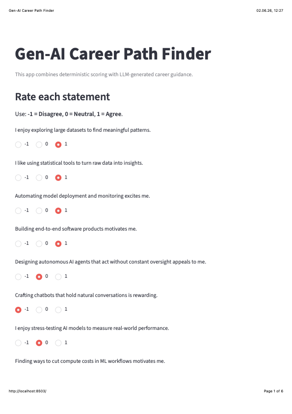

# Gen-AI Career Path Finder

A beginner-friendly Streamlit app that combines **deterministic Python scoring** with **LLM-generated career guidance** for Gen-AI roles.

## Why I Built This

I built this project to demonstrate, in one practical app, how classic programming and modern LLM capabilities can work together:
- Deterministic logic for reliable scoring and validation
- LLM generation for personalized explanation and recommendations

## What This Project Demonstrates

- How to convert a prompt idea into a complete local AI application
- How to separate deterministic and non-deterministic layers clearly
- How to structure an AI portfolio project for GitHub

## Deterministic vs LLM Parts

| Area | Deterministic Python | LLM-Generated |
|---|---|---|
| Input handling | Collects `-1/0/1` responses for 10 statements | Not used |
| Validation | Ensures all questions are answered | Not used |
| Scoring | Calculates category scores and top categories | Not used |
| Data structure | Builds `score_summary` dictionary | Consumes this data |
| Career report | Not used | Creates personalized markdown report |
| Recommendations | Not used | Suggests career paths, steps, roadmap, portfolio idea |

## Features

- 10 Gen-AI preference statements with fixed rating choices
- Deterministic score calculation per category
- Top-category and total-score summary
- LLM-generated personalized career report
- Error handling and fallback output when API calls fail
- Clean UI separation between deterministic and LLM output

## Tech Stack

- Python
- Streamlit
- OpenAI-compatible Chat Completions (`openai` Python SDK)
- `python-dotenv`

## Folder Structure

```text
genai-career-path-finder/
├── app.py
├── career_data.py
├── scoring.py
├── llm_client.py
├── prompts.py
├── requirements.txt
├── .env.example
├── README.md
├── screenshots/
│   └── .gitkeep
└── .gitignore
```

## Setup Instructions for Mac

### 1) Create and enter project folder

```bash
mkdir genai-career-path-finder
cd genai-career-path-finder
```

### 2) Create and activate virtual environment

```bash
python3 -m venv .venv
source .venv/bin/activate
```

### 3) Install requirements

```bash
pip install -r requirements.txt
```

## Environment Variable Setup

1. Copy `.env.example` to `.env`
2. Add your API key:

```bash
cp .env.example .env
```

Then edit `.env`:

```env
OPENAI_API_KEY=your_real_key_here
OPENAI_MODEL=gpt-4o-mini
```

## How to Run Locally

```bash
streamlit run app.py
```

Open the local URL shown in the terminal (usually `http://localhost:8501`).

## Screenshots

### PDF Report (Clickable Preview)

[](screenshots/Gen-AI%20Career%20Path%20Finder.pdf)

Click the preview image above to open the full PDF report.

## Future Improvements

- Add response history export (JSON/CSV)
- Add multiple-question weighting options
- Add more advanced scoring explanations
- Add optional model/provider selection in the UI
- Add deployment (Streamlit Community Cloud, Docker, or Render)

## Learning Reflection

This project strengthened my understanding of:
- Deterministic control flow vs probabilistic generation
- Prompt engineering for structured markdown outputs
- Error-resilient LLM integration in real applications
- Building portfolio-ready AI projects with clean architecture
